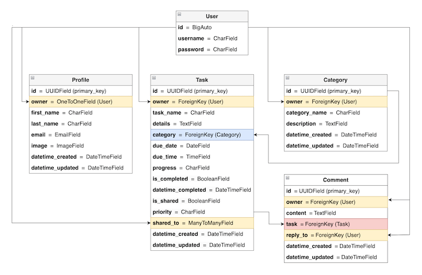

# Tasks Master API
This is the API for that serves the **Tasks Master** React application. This API is developed using the [Django Rest Framework](https://www.django-rest-framework.org/) and contains 4 models: profiles, categories, tasks, and comments. Click [**Here**](https://tasks-master-api.herokuapp.com/) for the deployed API.

Click [**Tasks Master**](http://tasks-master.herokuapp.com/) to view live React Application website.

## TABLE OF CONTENTS

## **Development Goal:**
The main goal of this API is to allow the React application entitled [**Tasks Master**](http://tasks-master.herokuapp.com/) to retrieve, post and update data related to users' profiles, tasks, task categories, and comments.

## **The Use of Agile Methodology**

[<ins>Back to Table of Contents</ins>](#table-of-contents)

### **EPICS:**
1. [Initial Project Setup](https://github.com/marked-gil/tasks-master-api/issues/1)
2. [Data Models](https://github.com/marked-gil/tasks-master-api/issues/2)
3. [Model Serializers](https://github.com/marked-gil/tasks-master-api/issues/3)
4. [Profiles](https://github.com/marked-gil/tasks-master-api/issues/4)
5. [Tasks](https://github.com/marked-gil/tasks-master-api/issues/5)
6. [Categories](https://github.com/marked-gil/tasks-master-api/issues/7)
7. [Comments](https://github.com/marked-gil/tasks-master-api/issues/8)
8. [Authentication and Authorization](https://github.com/marked-gil/tasks-master-api/issues/10)
9. [API Deployment](https://github.com/marked-gil/tasks-master-api/issues/11)

[<ins>Back to Table of Contents</ins>](#table-of-contents)

### **User Stories**

The following are the User Stories that guided the creation of this API:

* **User Story:** [**Setup Django and Cloudinary for API**](https://github.com/marked-gil/tasks-master-api/issues/12)
    > As a developer, I want Django and Cloudinary installed, so that I can create the initial Django app and connect it to Cloudinary as storage.

    Implementation:      
    * Install Django, django-cloudinary-storage, and Pillows libraries
    * Configure settings.py to include the Cloudinary storage by importing it as an environment variable.
    * Add ‘cloudinary_storage’ and ‘cloudinary’ in setting.py’s INSTALLED_APPS

* **User Story:** [**Initial Setup of the API's Environment**](https://github.com/marked-gil/tasks-master-api/issues/13)    
    > As a developer, I want to create environment variables so sensitive information or data can be protected.

    Implementation:
    * Create an env.py in the top directory
    * Place all sensitive data inside the env.py file, e.g. ‘cloudinary URL’, ‘Django Secret Key’

* **User Story:** [**Profile Model**](https://github.com/marked-gil/tasks-master-api/issues/14) 
    > As a developer, I can automatically create a profile for each signed-up user so that they can add other personal information such as name, email, and profile picture.

    Implementation: 
    * Create the ‘profiles’ app
    * Add the ‘profiles’ app in setting.py’s INSTALLED_APPS
    * Create a Profile model with fields, such as id, owner, first_name, last_name, image, email, datetime_created, datetime_updated, etc.
    *Register the Profile model in the admin.py

* **User Story:** [**Task Model**](https://github.com/marked-gil/tasks-master-api/issues/15)
    > As a developer, I can save in the database the tasks created by users so they can be returned on request.     

    Implementation: 
    * Create ‘tasks’ app
    * Add the ‘tasks’ app in setting.py’s INSTALLED_APPS
    * Create a Task Model with fields, such as id, owner, task_name, details, datetime_created, datetime_updated, due_date, due_time, category, priority, progress, etc.
    * Register the Task Model in the admin.py

* **User Story:** [**Category Model**](https://github.com/marked-gil/tasks-master-api/issues/17)
    > As a developer, I can save categories to the database so tasks are categorized.       

    Implementation: 
    * Create ‘categories’ app
    * Add the ‘categories’ app in settings.py’s INTALLED_APPS
    * Create a Category model with fields, such as owner, category_name, description, datetime_created, datetime_updated, etc.
    * Register the Category model in the admin.py

* **User Story:** [**Comment Model**](https://github.com/marked-gil/tasks-master-api/issues/18)
    > As a developer, I can allow users to create comments on tasks and save them in the database.

    Implementation: 
    * Create ‘comments’ app
    * Add the ‘comments’ app in settings.py’s INSTALLED_APPS
    * Create a Comment model with fields, such as id, owner, content, datetime_created, datetime_updated, task, reply_to, is_reply_to_comment, etc.
    * Register the Comment model in the admin.py

* **User Story:** [**Setup Django REST Framework**](https://github.com/marked-gil/tasks-master-api/issues/20)   
    > As a developer, I can use the Django REST Framework to build the API so it will be quick, reliable, and secure.

    Implementation:
    * Install Django REST Framework - djangorestframework
    * Add the ‘rest_framework’ in settings.py’s INSTALLED_APPS

* **User Story:** [**ProfileSerializer**](https://github.com/marked-gil/tasks-master-api/issues/21)
    > As a developer, I can serialize the data from the Profile model so they can be outputted in the API as JSON objects.  

    Implementation:
    * Create serializers.py inside the ‘profiles’ directory
    * Create ProfileSerializer with fields, such as id, owner, first_name, last_name, image, email, datetime_created, datetime_updated, etc.

* **User Story:** [**TaskSerializer**](https://github.com/marked-gil/tasks-master-api/issues/22)    
    > As a developer, I can serialize the data from the Task model so they can be outputted in the API as JSON objects. 

    Implementation:
    * Create serializers.py inside the ‘tasks’ directory
    * Create TaskSerializer with fields, such as id, owner, task_name, description, description, date_created, date_updated, due_date, due_time, category, priority, progress, etc

* **User Story:** [**CategorySerializer**](https://github.com/marked-gil/tasks-master-api/issues/24)    
    > As a developer, I can serialize the data from the Category Model so they can be outputted in the API as JSON objects.

    Implementation:
    * Create serializers.py inside the ‘categories’ directory
    * Create CategorySerializer with fields, such as owner, category_name, description, datetime_created, datetime_updated, etc.

* **User Story:** [**CommentSerializer**](https://github.com/marked-gil/tasks-master-api/issues/25)
    > As a developer, I can serialize the data from the Comment model so they can be outputted in the API as JSON objects.

    Implementation:
    * Create serializers.py inside the ‘comments’ directory
    * Create CommentSerializer with fields, such as id, owner, content, datetime_created, datetime_updated, task, reply_to, is_reply_to_comment, etc.

* **User Story:** [**API Profile List**](https://github.com/marked-gil/tasks-master-api/issues/27)
    > As a developer, I can return a list of all profiles when requested in the API.

    Implementation:
    * Set up ProfileList view
    * Set up the URL path to retrieve the list of profiles
    * Return a list of all profiles from the API as a response to a GET request

* **User Story:** [**API Profile Details**](https://github.com/marked-gil/tasks-master-api/issues/28)
    > As a developer, I can return the profile details of a user when requested in the API.

    Implementation:
    * Set up ProfileDetails view
    * Set up the URL path to retrieve the user's profile details
    * Return the user’s profile details as a response to a GET request for a specific user id.

* **User Story:** [**Create Profile in API**](https://github.com/marked-gil/tasks-master-api/issues/29)
    > As a developer, I can allow the automatic creation of a profile for newly created/signed-up users.
    
    Implementation: 
    *  Automatically create a profile for a user that signs up to the site.

* **User Story:** [**Update Profile in API**](https://github.com/marked-gil/tasks-master-api/issues/30)
    > As a developer, I can allow a user to update their image, email, first name, and last name.

    Implementation: 
    * Allow user to update their image, first name, last name, and email address.
    * Prevent the editing of usernames.
    * Add a validation check for the uploaded image to prevent uploading of a large image that is beyond the set parameter.

* **User Story:** [**Delete Profile/Account in the API**](https://github.com/marked-gil/tasks-master-api/issues/31)
    > As a developer, I can allow a user to delete their profile from the database when they delete their account.

    Implementation:
    * Allow deletion of the user and user’s profile from the database when a request is sent to the API.
    * Only allow the logged-in user to delete their own account/profile.

* **User Story:** [**API Task List**](https://github.com/marked-gil/tasks-master-api/issues/32)
    > As a developer, I can return a list of all tasks when requested in the API.

    Implementation:
    * Set up TaskList view
    * Set up the URL path to retrieve the list of tasks
    * Return a list of all tasks from the API as a response to a GET request.

* **User Story:** [**API Task Details**](https://github.com/marked-gil/tasks-master-api/issues/33)
    > As a developer, I can return the details of a task when requested in the API.
    
    Implementation:
    * Set up TaskDetails view
    * Set up the URL path to retrieve the user's task details
    * Return the details of a task as a response to a GET request.

* **User Story:** [Create Task in API ](https://github.com/marked-gil/tasks-master-api/issues/34)
    > As a developer, I can allow the creation of new tasks and save them in the database.

    Implementation:
    * Allow users to create and save a new task in the database.

* **User Story:** [**Update Task in API**](https://github.com/marked-gil/tasks-master-api/issues/35)
    > As a developer, I can allow users to update their created tasks so they can amend mistakes or make changes as they see fit.
    
    Implementation:
    *  Allow users to make changes to their task’s name, details, category, due date and time, and priority setting.

* **User Story:** [**Delete Task in API**](https://github.com/marked-gil/tasks-master-api/issues/36)
    > As a developer, I can allow users to delete tasks.
    
    Implementation:
    *  Allow users to delete their created tasks.

* **User Story:** [**Update the Users Sharing a Task in API**](https://github.com/marked-gil/tasks-master-api/issues/40)
    > As a developer, I can allow the owner of the shared task to change who the task is shared with.

    Implementation:
    * Allow owners to change who their shared task is shared with by adding or removing users from the task.

* **User Story:** [**API Category List]**(https://github.com/marked-gil/tasks-master-api/issues/42)
    > As a developer, I can return a list of all categories when requested in the API.
    
    Implementation:
    * Set up CategoryList view
    * Set up the URL path to retrieve the list of categories
    * Return a list of all categories from the API as a response to a GET request.
* **User Story:** [**API Category Details**](https://github.com/marked-gil/tasks-master-api/issues/43)
    > As a developer, I can return the details of a task when requested in the API.

    Implementation:
    * Set up CategoryDetails view
    * Set up the URL path to retrieve a category's details
    * Return the details of a category as a response to a GET request.

* **User Story:** [**Create Category in API**](https://github.com/marked-gil/tasks-master-api/issues/44)
    > As a developer, I can allow users to create categories for their tasks.

    Implementation:
    * Allow users to create new task categories.

* **User Story:** [**Update Category in API**](https://github.com/marked-gil/tasks-master-api/issues/45)
    > As a developer, I can users edit the category’s name and description.
    
    Implementation:
    * Allow users to edit the category’s name and description.

* **User Story:** [**Delete Category in API**](https://github.com/marked-gil/tasks-master-api/issues/46)
    > As a developer, I can users delete categories.
    
    Implementation:
    * Allow users to delete categories.

* **User Story:** [**API Comment List**](https://github.com/marked-gil/tasks-master-api/issues/47)
    > As a developer, I can return a list of all comments when requested in the API.
    
    Implementation:
    * Set up CommentList view
    * Set up the URL path to retrieve the list of comments
    * Return a list of all comments from the API as a response to a GET request

* **User Story:** [**API Comment Details**](https://github.com/marked-gil/tasks-master-api/issues/48)
    > As a developer, I can return the details of a comment when requested in the API.

    Implementation:
    * Set up CommentDetails view
    * Set up the URL path to retrieve the comment's details
    * Return the details of a comment as a response to a GET request.
* **User Story:** [**Create Comment in API**](https://github.com/marked-gil/tasks-master-api/issues/49)
    > As a developer, I can allow logged-in users to add comments to their tasks or shared task.

    Implementation:
    * Allow logged-in users to create a comment on their task or shared task.

* **User Story:** [**Update Comment in API**](https://github.com/marked-gil/tasks-master-api/issues/50)
    > As a developer, I can allow logged-in users to edit their comments.
    
    Implementation:
    * Allow logged-in users to edit their comment messages.

* **User Story:** [**Delete Comment in API**](https://github.com/marked-gil/tasks-master-api/issues/51)
    > As a developer, I can allow logged-in users to delete their comment and their associated comments created as a reply to them.
    
    Implementation:
    * Allow logged-in user to delete their comment.
    * Automatically delete all children comments (replies) to a deleted parent comment.

* **User Story:** [**Restrict Access and Creation of API Data to Authenticated Users Only**](https://github.com/marked-gil/tasks-master-api/issues/57)
    > As a developer, I want only authenticated (logged-in) users to view and/or create data.
    
    Implementation:
    * Add login and logout buttons on the browsable API using login and logout views
    * Allow only logged-in users to view and create API data.
    * Install dj-rest-auth library.
    * Install djangorestframework-simplejwt to add JWT authentication functionality.

* **User Story:** [**Restrict Retrieval of Data to their Owners and/or Permitted Users Only in the API**](https://github.com/marked-gil/tasks-master-api/issues/58)
    > As a developer, I can only allow authenticated owners and permitted users to retrieve their data.

    Implementation: 
    * Allow only logged-in owners to retrieve their tasks.
    * Allow only logged-in owners and permitted users to retrieve shared tasks.
    * Allow only logged-in owners to retrieve their category.
    * Allow only logged-in owners and permitted users to retrieve their comments.

* **User Story:** [**Restrict Editing of Data to the Owner of the Data in the API**](https://github.com/marked-gil/tasks-master-api/issues/59)
    > As a developer, I can allow the logged-in user who owns or created the data to modify it.
    
    Implementation:
    * Allow only the logged-in user who owns the profile to modify it.
    * Allow only the logged-in user who created the task to modify it.
    * Allow only the logged-in user who shared the task to edit the users sharing the task.
    * Allow only the logged-in user who created the category to modify it.
    * Allow only the logged-in user who created the comment to modify it.

* **User Story:** [**Restrict Deletion of Data to Authenticated Owners Only in the API**](https://github.com/marked-gil/tasks-master-api/issues/60)
    > As a developer, I can only allow authenticated users to delete their own tasks, shared tasks, categories, and comments.
    
    Implementation:
    * Allow only logged-in users to delete their own tasks.
    * Allow only logged-in. owners to delete their shared tasks.
    * Allow only logged-in users to delete their created categories.
    * Allow only logged-in users to delete their own comments.
    
* **User Story:** [**API Root Route**](https://github.com/marked-gil/tasks-master-api/issues/61)
    > As a developer, I want to add a ‘Welcome’ message to users accessing the default endpoint of the API.

    Implementation:
    *  At the root route, display the message “You have reached the API for Tasks Master.”

* **User Story:** [**API Pagination**](https://github.com/marked-gil/tasks-master-api/issues/62)
    > As a developer, I want to limit the number or size of data returned per request to efficiently manage the request load.

    Implementation:
    * In the project’s settings.py, add and set the DEFAULT_PAGINATION_CLASS
    * Set the PAGE_SIZE to 15.
    
* **User Story:** [**Connect Database and Heroku**](https://github.com/marked-gil/tasks-master-api/issues/63)
    > As a developer, I want to create the production database and connect it to Heroku.
    
    Implementation:
    * Create database instance in ElephantSQL.com
    * Create Heroku app
    * Add the DB URL to Heroku app’s config vars
    * Install dj_database_url==0.5.0 psycopg2, which is needed to connect to external database

* **User Story:** [**Preparing for API Deployment**](https://github.com/marked-gil/tasks-master-api/issues/64)
    > As a developer, I want the project to be ready for deployment to Heroku.

    Implementation:
    * Set default renderer to JSON
    * Set date & time format
    * Install gunicorn django-cors-headers
    * Create Procfile
    * Set up CORS_ALLOWED_ORIGINS & CORS_ALLOWED_CREDENTIALS
    * Set JWT_AUTH_SAMESITE to None

* **User Story:** [**Automatic Creation of Default Categories in the API**](https://github.com/marked-gil/tasks-master-api/issues/65)
    > As a developer, I can automatically create default categories for users on sign-up.
    
    Implementation:
    * Create 2 default categories: ‘At Home’ and ‘At Work’
    * Automatically create the 2 default categories when the profile is automatically created for a signed-up user.

* **User Story:** [**Allow User Registration**](https://github.com/marked-gil/tasks-master-api/issues/66)
    > As a developer, I can allow user registration using dj-rest-auth library.
    
    Implementation:
    * Install 'dj-rest-auth[with_social]'
    * Add the following to INSTALLED_APPS: django.contrib.sites, allauth, allauth.account, allauth.socialaccount and dj_rest_auth.registration
    * "SITE_ID = 1" in settings.py
    * Add dj_rest_auth.registration urls

* **User Story:** [**Filter Task List in the API**](https://github.com/marked-gil/tasks-master-api/issues/67)
    > As a developer, I can allow filtering of tasks by ordering, searching, and using filterset.
    
    Implementation:
    * Install django_filters and add it to INSTALLED_APPS
    * Add OrderingFilter and fields, such as due_date, due_time, priority
    * Add SearchFilter and fields, such as category, and task name
    * Add filterset_fields, such as due_date, priority, progress, category

[<ins>Back to Table of Contents</ins>](#table-of-contents)

## **API Endpoints**
Displayed below are the API endpoints and their corresponding methods that can be performed.

## **Database Schema**
The database for Tasks Master API contains four (4) custom models, namely Profile, Task, Category, and Comment; and also the default User model. The schema displayed below shows the relationship among these models.

## **Security Features**
To ensure the security of data submitted by users and saved in the database, specific restrictions are set to retrieve, view, edit, add and delete data.

|Endpoint   | Permission  | Description |
| --------- | ----------- | ----------- |
| profiles/ | IsAuthenticated | Only aunthenticated/logged in users can view the list of profiles |
| profiles/<str:id> | IsOwner, IsAuthenticatedReadOnly | Only the owner can update and delete their profile, while authenticated users may view other profiles |
| tasks/	| IsAuthenticated | Only authenticated owners can retrieve and create tasks |
| tasks/<str:id> | IsOwner, IsAuthenticatedReadOnly | Only owners can update and delete their tasks, while other authenticated users may possibly view others' tasks |
| categories/ | IsAuthenticated | Authenticated users can view and create categories |
| categories/<str:id> | IsOwner | Only owners can update and delete their categories |
| comments/ | IsAuthenticated | Only authenticated users can view and create comments |
| comments/<str:id> | IsOwner, IsAuthenticated | Only owners can update and delete their comments |

## Features Left for Future Implementation

The following user stories are left for future implementation:

* **User Story:** [**Notification Model**](https://github.com/marked-gil/tasks-master-api/issues/19)
    > As a developer, I can save notifications in the database so I can use and display them in the front end.

    Implementation: 
    * Create ‘notifications’ app
    * Add the ‘notifications’ app in settings.py’s INSTALLED_APPS
    * Create the Notification model with fields, such as id, message, sender, receiver, is_seen, task, comment, etc.
    * Register the Notification model in the admin.py

* **User Story:** [**NotificationSerializer**](https://github.com/marked-gil/tasks-master-api/issues/26)
    > As a developer, I can serialize the data from the Notification model so they can be outputted in the API as JSON objects.

    Implementation: 
    * Create serializers.py inside the ‘notifications’ directory
    * Create NotificationSerializer with fields, such as id, message, sender, receiver, is_seen, task, comment, etc.

* **User Story:** [**API Notification List**](https://github.com/marked-gil/tasks-master-api/issues/52)
    > As a developer, I can return a list of all notifications when requested from the API.

    Implementation: 
    * Return a list of all notifications from the API as a response to a GET request.

* **User Story:** [**API Notification Details**](https://github.com/marked-gil/tasks-master-api/issues/53)
    > As a developer, I can return the details of a notification when requested in the API.

    Implementation: 
    *  Return the details of a notification as a response to a GET request.

* **User Story:** [**Create Notification for New SharedTask in the API**](https://github.com/marked-gil/tasks-master-api/issues/54)
    > As a developer, I can automatically create notification for the new shared task and save them in a database.

    Implementation: 
    * Automatically create a notification for a new shared task.

* **User Story:** [**Create Notification for Overdue Tasks in the API**](https://github.com/marked-gil/tasks-master-api/issues/55)
    > As a developer, I can automatically create a notification for an overdue task and save it in a database.

    Implementation: 
    *  Automatically create a notification for an overdue task.

* **User Story:** [**Create Notification for a New Comment in the API**](https://github.com/marked-gil/tasks-master-api/issues/56)
    > As a developer, I can automatically create a notification for a new comment to a shared task.

    Implementation: 
    * Automatically create a notification for a new comment.

[<ins>Back to Table of Contents</ins>](#table-of-contents)

## Fixed Bugs

* ISSUE: I was migrating my app models to the production database but I got an error: `django.db.utils.ProgrammingError: cannot cast type integer to uuid` in my **comments** app. And so, I thought the easiest way to do was to delete my migration files from the `migrations` directory (which, now I learned, is not the best way to solve it). Unfortunately, when I did the migration again, I was presented with another error: `django.db.migrations.exceptions.InconsistenMigrationHistory`.

    * INTENDED OUTCOME:     
    I want my models to be succesfully migrated to my PostgreSQL database to allow my application to run smoothly in production.

    * SOLUTION:     
    As I do not have much data stored in the database yet, I just deleted the old database and created a new one. After having done that, I did the migration again. This time it worked. I got the idea to solve it from this link: https://forum.djangoproject.com/t/django-db-migrations-exceptions-inconsistenmigrationhistory/14129

## Bugs Left To Fix
After thorough testing, there are no bugs that were noted by the developer of the site.

[<ins>Back to Table of Contents</ins>](#table-of-contents)

## Testing

## Deployment

### **Version Control**

**Git** was a crucial tool used to track changes that were made in the repository. The following git commands were mainly used in developing this program:

* `git status` — to show the status of the repository by displaying the files that have been staged and are ready for commit, those that are not, and those that are untracked. 
* `git add <file name>` — to add file or changes in the file to the staging area before they can be committed
* `git commit -m "message"` — to add/record files or changes to the local repository
* `git push` — to upload the local repository to the remote repository, such as GitHub

### **Heroku Deployment**

### **Cloning from GitHub**

[<ins>Back to Table of Contents</ins>](#table-of-contents)

## Technologies
This project uses the following tools:
* Backend Programming Language:
    * [Python](https://www.python.org/)
* Web Framework:
    * [Django](https://www.djangoproject.com) - web framework used in developing this project
    * [Django REST Framework](https://www.django-rest-framework.org/) - toolkit used to build this web API
* Deployment Platform:
    * [Heroku](https://www.heroku.com) - the cloud platform used for deployment of the website
* Media and Asset Storage:
    * [Cloudinary](https://cloudinary.com/) - where the assets of this project, including photos are stored
* Database:
    * [ElephantSQL](https://www.elephantsql.com/) - serves as the PostgreSQL database for this project
* Modules and Libraries:
    * [django-database-url](https://pypi.org/project/dj-database-url/) - used for connecting Django to database
    * [django-cloudinary-storage](https://pypi.org/project/django-cloudinary-storage/) - facilitates integration with Cloudinary by implementing Django Storage API
    * [cloudinary](https://pypi.org/project/cloudinary/) - to quickly and easily integrate the application with Cloudinary
    * [dj-rest-auth](https://dj-rest-auth.readthedocs.io/en/latest/index.html) - a set of REST API endpoints to handle User Registration and Authentication tasks.
    * [Simple JWT]((https://django-rest-framework-simplejwt.readthedocs.io/en/latest/getting_started.html)) (`djangorestframework-simplejwt`) - provides a JSON Web Token authentication backend for the Django REST Framework
    * [datetime module](https://docs.python.org/3/library/datetime.html) - used for the created dates in the project
    * `OS` module in Python - used in the `settings.py` file to perform functions that involve the operating system, such as checking for environment variables

* [Miniwebtool](https://miniwebtool.com/django-secret-key-generator/) - as Django secret_key generator
* `Git` - as a version control system, was used to monitor and record changes made when building the site. This allowed for the restoration of an earlier version of the code when it was necessary
* `Gitpod` - the cloud-based IDE (Integrated Developer Environment) used to code this site
* `GitHub` - stores the source code repository for this website
* [Diffchecker](https://www.diffchecker.com/#) - used when comparing codes tested in another IDE to the codes in gitpod     
* [Grammarly](https://www.grammarly.com/) - used to check the grammar of the contents in this project   
* Web browsers (Google Chrome, Firefox, Safari, Microsoft Edge) 
* For Testing and Validation:   
    * [CI Python Linter](https://pep8ci.herokuapp.com/) 

[<ins>Back to Table of Contents</ins>](#table-of-contents)

## Credits

* [Stackoverflow](https://stackoverflow.com/questions/65908861/how-to-automatically-create-new-profile-once-a-new-user-is-created-in-django) - How to automatically create a profile for registered users using @receiver decorator and Django signal
* [Stackoverflow](https://stackoverflow.com/questions/29642390/how-to-filter-serializers-slugrelatedfield-queryset-using-model-field) - Modifying SlugRelatedField to return a filtered queryset
* [Code Institute's drf-api repo](https://github.com/Code-Institute-Solutions/drf-api/blob/c637122d1a559139cabf1d39b0a3281814091d79/posts/serializers.py) - Code for the image validation
* [Edureka! Community](https://www.edureka.co/community/74191/how-update-date-automatically-after-value-change-in-django) - How to update a date automatically when a value changes in Django

### References
* Main References:
    * [Code Institute](https://codeinstitute.net/ie/)
    * [Django Documentation](https://docs.djangoproject.com/en/3.2/)    

## Acknowledgment